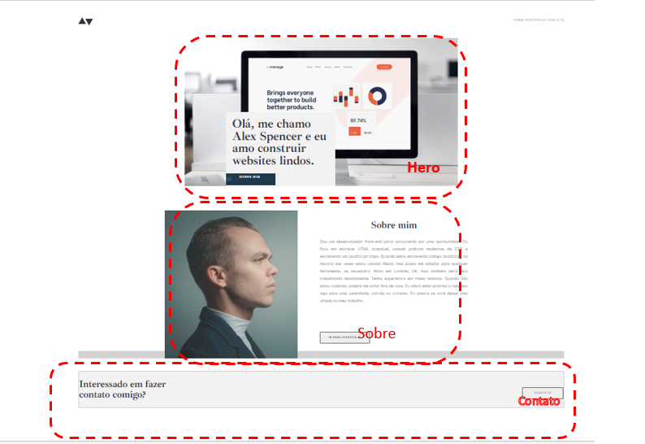

Profile digital

Esse projeto foi resultado do estudo do módulo de CSS. Onde foi apresentado a estilização de objetos e texto para formatação do site. O objetivo era formatar um perfil para compartilhar informações pessoais e de experiencia de uma pessoa em busca de uma posição no mercado de trabalho.
A página principal (home) possui as seções Hero, Sobre e Contato. Na seção Hero uma breve apresentação do candidato, na seção Sobre, deve possuir um pequeno texto sobre experiencias e aptidões e contato deve levar a uma nova página.

Esse projeto é totalmente estático, não sendo possível interagir com outros sites e/ou páginas. Para proporcionar responsidade foi utilizado o layout flex.
